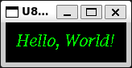

# u8g2-fonts

[](examples/simulator/src/bin/hello_world_banner.rs)

[](https://crates.io/crates/u8g2-fonts)
[](https://crates.io/crates/u8g2-fonts)
[](https://github.com/Finomnis/u8g2-fonts/blob/main/LICENSE)
[](https://github.com/Finomnis/u8g2-fonts/actions/workflows/ci.yml?query=branch%3Amain)
[](https://docs.rs/u8g2-fonts)
[](https://coveralls.io/github/Finomnis/u8g2-fonts?branch=main)

This crate is a pure Rust reimplementation of the font subsystem of [U8g2](https://github.com/olikraus/u8g2).

It is intended for the [embedded-graphics](https://crates.io/crates/embedded-graphics) ecosystem.


## Licensing

While this crate is MIT / Apache-2.0 licensed, note that the fonts themselves *are not*.

For more information about the font licenses, read the [license agreement](https://github.com/olikraus/u8g2/blob/master/LICENSE) of U8g2.


## Example

```rust
let font = FontRenderer::new::<fonts::u8g2_font_haxrcorp4089_t_cyrillic>();
let text = "embedded-graphics";

font.render_text_aligned(
    text,
    display.bounding_box().center() + Point::new(0, 16),
    u8g2_fonts::types::FontColor::Transparent(BinaryColor::On),
    VerticalPosition::Baseline,
    HorizontalAlignment::Center,
    &mut display,
)
.unwrap();
```

This example is based on the `hello-world` of the official [embedded-graphics examples](https://github.com/embedded-graphics/examples.

If we replace the text rendering section of the example with the code above, it produces this output:

[](examples/simulator/src/bin/embedded_graphics_hello_world.rs)

If you [run this code](examples/simulator/src/bin/readme_example.rs) against a [`DrawTarget`](https://docs.rs/embedded-graphics-core/latest/embedded_graphics_core/draw_target/trait.DrawTarget.html) of your choice, you will see:




Similarly, rendered to a real b/w display:


